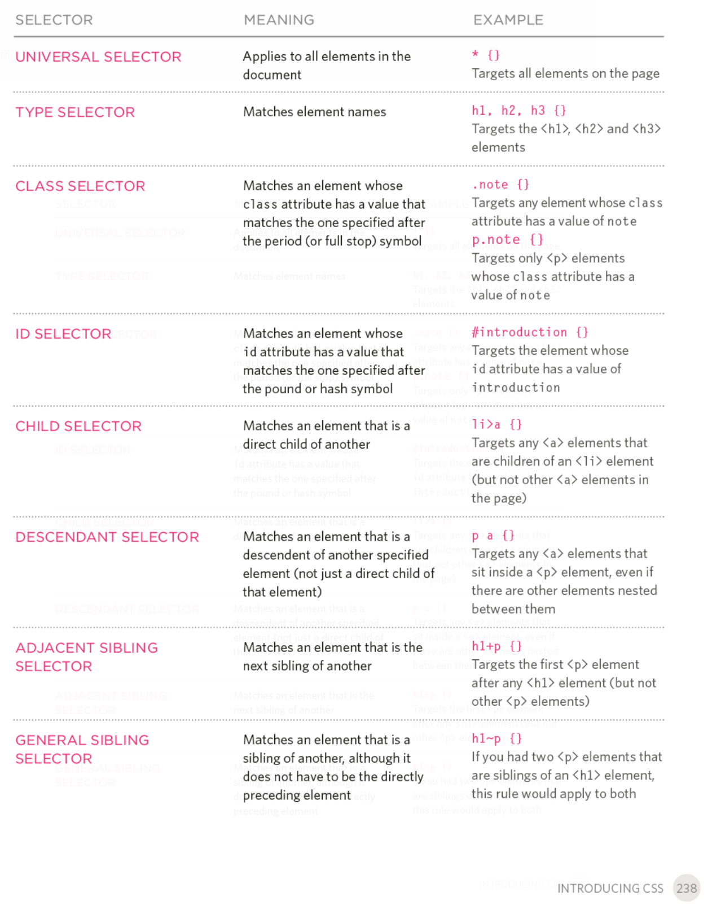

# Week 3 - CSS

## Review

1. HTML documents are defined by sets of *tags*. A tag has both an opening and closing, e.g. <html></html>

2. Tags can have attributes which modify how the tag behaves

3. We looked at several html tags including lists, tables, headers, and forms

## CSS

### What is CSS?

- CSS stands for cascading style sheets. 
- CSS is what makes websites look attractive. Plain HTML is pretty boring
- A css file contains a set of rules to *style* you html elements.
    - For example, style can change font colors, sizes, background colors, etc.
- CSS can often also be done inline (instead of in a separate file) but using the style attribute of many html tags. 
    - This is ok if you want to style one element, but often you want to style many elements. In order to do this it is often more convenient to separate all the CSS styling in to a separate file

### Writing CSS

- A CSS rule consists of TWO parts, a **selector** and a **declaration**
- The **selector** says *which* html elements the rule applies to
- The **declaration** says *how* the elements are to be styled
    - Each declaration has 2 parts - the **property** and the **value**


#### Simple Example

So if we want to make all h1 tags yellow
```css
h1 {color: yellow;}
```

or to make all h1, h2, and h3 tags yellow
```css
h1, h2, h3 {color: yellow;}
```

### 3 Ways to include CSS

1. In the header:

```html
<html>
    <head>
        <style type="text/css">
            h1 {color: yellow;}
        </style>
    </head>
    <body>
        <h1>My Web Page</h1>
        <h1>Another Heading!</h1>
    </body>
</html>
```

2. In the body

```html
<html>
   </head>
    <body>
        <h1 style="color:yellow;">My Web Page</h1>
        <h1>Another Heading!</h1>
    </body>
</html>
```

3. In a separate stylesheet

**style.css**
```css
h1 {color: yellow;}
```

**index.html**
```html
<html>
    <head>
        <link href="style.css" rel="stylesheet" type="text/css">
    </head>
    <body>
        <h1 style="color:yellow;">My Web Page</h1>
        <h1>Another Heading!</h1>
    </body>
</html>
```

#### Separation of Content and Presentation    

CSS allows you to separate the content and structure of a webpage from its presentation. This makes it easier to make changes to the design of your website without affecting the content. This is why external style sheets are generally preferred for the bulk of your styling. [^1]

For instance in a multipage website, the users computer only downloads the style sheet once and then all pages are updated

[^1]: Taken from [webtutor.dev](https://webtutor.dev/css/css-introduction)

## Do Exercise 1

### Other selectors

So far we've only used tag names as selectors. But what if you only wanted *some* h1 elements to be formatted a certain way? Or a set of different tags to all by the same color?

You can select by `class`, you can apply the `class` attribute to any html tag

There are also action selectors, `:hover`, `:active`, `:focus`



### Some examples of stuff we can style

`color` - foreground color 

`background-color` - background color

`font-family` - Set the font used

`font-size` - the size of the font

`font-weight` - normal/bold

`font-style` - normal/italic/oblique

`text-transform` - uppercase/lowercase/capitalize

`text-decoration` - none/underline/overline/line-through/blink

`text-align` - left/center/justify/right

[CSS Reference - w3Schools.com](https://www.w3schools.com/css/default.asp)