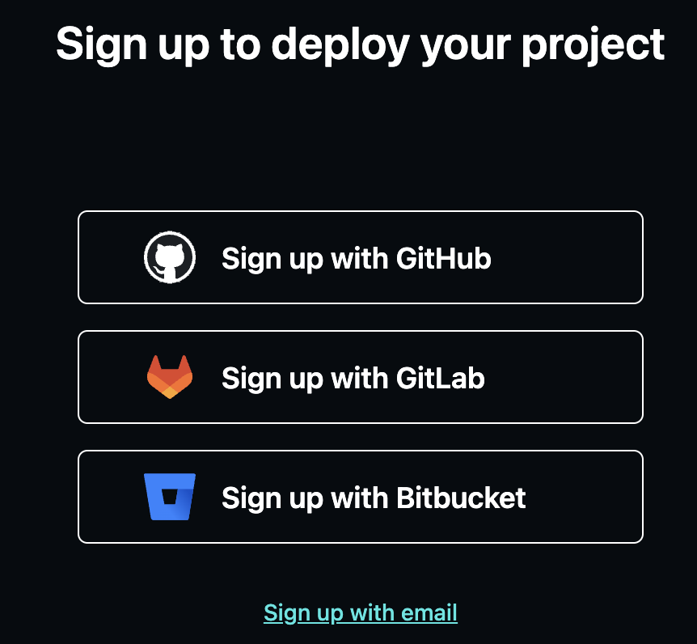
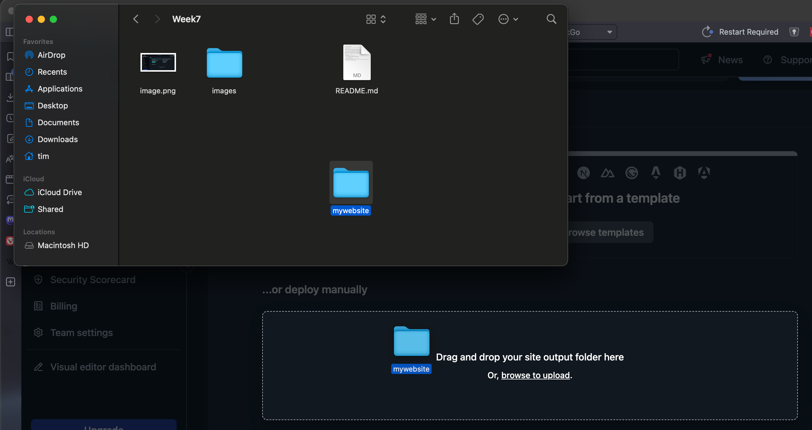
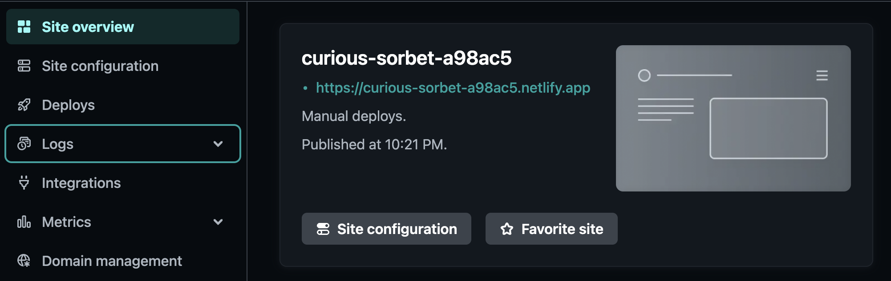
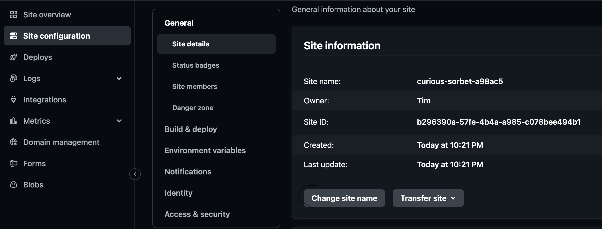
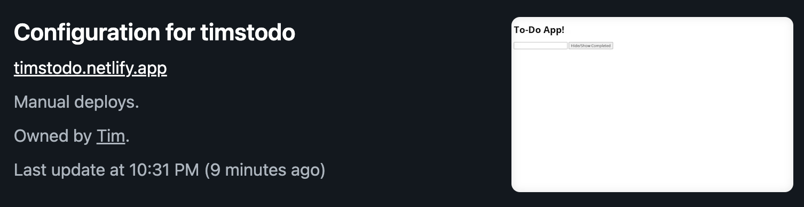

# Week 7 - Publishing You Website

## How to Publish a Website

So you've made a website and you like it. You want others to see your awesome website. How do you do it? 

You need a **hosting service**.

A **hosting service** will store your website on a server somewhere in the world (actually in many cases it stores your website on many servers all over the world so that it can be accessed quickly from anywhere). 

It will also allow you to assign a **domain name** to your website (e.g. www.mywebsite.com). 

In our case we are going to use hosting service name netlify, which specifically hosts **static websites**

The type of websites we have focused on in this class are called static websites. That is, websites whose files don't change. Even though the website might be dynamic (or interactive), the underlying javascript files are static (do not change).

Creating a dynamic site is a much more complex task and might be a good topic for another class.

## Steps to Publish a Site on Netlify

1. Go to netlify.com
1. Click "Sign Up!" button in the top right corner
1. Click "Sign Up with Email" at the bottom of the sign up options

    a. 

1. Enter your email and a password

    a. 
1. click on "team overview" in the top left
1. Drag and drop the folder with your website (main page must be nanmed index.html) into the "deploy manually" dotted line box

    
1. Next click the "Site Overview" button on the left and you will see a random name that and below it a web address that represents your new site.

    
1. Click on "Site Configuration" then "Change Site Name" and give it a new name

    
1. You can click the link to go to your new address. Have someone else also test your new address

    